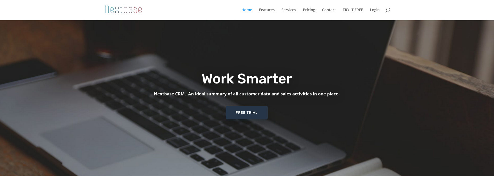

Testing framework used for running automation tests in https://nextbasecrm.com/.

<!-- Improved compatibility of back to top link: See: https://github.com/othneildrew/Best-README-Template/pull/73 -->

<!--
*** Thanks for checking out the Best-README-Template. If you have a suggestion
*** that would make this better, please fork the repo and create a pull request
*** or simply open an issue with the tag "enhancement".
*** Don't forget to give the project a star!
*** Thanks again! Now go create something AMAZING! :D
-->

<!-- PROJECT SHIELDS -->
<!--
*** I'm using markdown "reference style" links for readability.
*** Reference links are enclosed in brackets [ ] instead of parentheses ( ).
*** See the bottom of this document for the declaration of the reference variables
*** for contributors-url, forks-url, etc. This is an optional, concise syntax you may use.
*** https://www.markdownguide.org/basic-syntax/#reference-style-links
-->
[![Contributors][contributors-shield]][contributors-url]
[![Forks][forks-shield]][forks-url]
[![Stargazers][stars-shield]][stars-url]
[![Issues][issues-shield]][issues-url]
[![MIT License][license-shield]][license-url]
[![LinkedIn][linkedin-shield]][linkedin-url]

<!-- PROJECT LOGO -->
 

  

  <h3 align="center">CYDEO PROJECT</h3>

  

     
    <a href="https://github.com/makifyegin/nextBase0/issues">Report Bug</a>
  

<!-- CONTACT -->
## Contact

Project Link: [https://github.com/makifyegin/nextBase0](https://github.com/makifyegin/nextBase0)

(<a href="#readme-top">back to top</a>)

<!-- ACKNOWLEDGMENTS -->
## Acknowledgments

Use this space to list resources you find helpful and would like to give credit to. I've included a few of my favorites to kick things off!

* [Choose an Open Source License](https://choosealicense.com)
* [GitHub Emoji Cheat Sheet](https://www.webpagefx.com/tools/emoji-cheat-sheet)
* [Malven's Flexbox Cheatsheet](https://flexbox.malven.co/)
* [Malven's Grid Cheatsheet](https://grid.malven.co/)
* [Img Shields](https://shields.io)
* [GitHub Pages](https://pages.github.com)
* [Font Awesome](https://fontawesome.com)
* [React Icons](https://react-icons.github.io/react-icons/search)

(<a href="#readme-top">back to top</a>)

<!-- MARKDOWN LINKS & IMAGES -->
<!-- https://www.markdownguide.org/basic-syntax/#reference-style-links -->
[contributors-shield]: https://img.shields.io/github/contributors/makifyegin/nextBase0.svg?style=for-the-badge
[contributors-url]: https://github.com/makifyegin/nextBase0/graphs/contributors
[forks-shield]: https://img.shields.io/github/forks/makifyegin/nextBase0.svg?style=for-the-badge
[forks-url]: https://github.com/makifyegin/nextBase0/network/members
[stars-shield]: https://img.shields.io/github/stars/makifyegin/nextBase0.svg?style=for-the-badge
[stars-url]: https://github.com/makifyegin/nextBase0/stargazers
[issues-shield]: https://img.shields.io/github/issues/makifyegin/nextBase0.svg?style=for-the-badge
[issues-url]: https://github.com/makifyegin/nextBase0/issues
[license-shield]: https://img.shields.io/github/license/makifyegin/nextBase0.svg?style=for-the-badge
[license-url]: https://github.com/makifyegin/nextBase0/blob/master/LICENSE.md
[linkedin-shield]: https://img.shields.io/badge/-LinkedIn-black.svg?style=for-the-badge&logo=linkedin&colorB=555
[linkedin-url]: https://linkedin.com/in/makifyegin
[product-screenshot]: images/screenshot.png

[Next.js]: https://img.shields.io/badge/-selenium-%43B02A?style=for-the-badge&logo=selenium&logoColor=white
[Next-url]: https://nextjs.org/makifyegin
[React.js]: https://img.shields.io/badge/git-%23F05033.svg?style=for-the-badge&logo=git&logoColor=white
[React-url]: https://reactjs.org/
[Vue.js]: https://img.shields.io/badge/github-%23121011.svg?style=for-the-badge&logo=github&logoColor=white
[Vue-url]: https://vuejs.org/

[Angular.io]: https://img.shields.io/badge/java-%23ED8B00.svg?style=for-the-badge&logo=java&logoColor=white

[Angular-url]: https://angular.io/

[Svelte.dev]: https://img.shields.io/badge/jenkins-%232C5263.svg?style=for-the-badge&logo=jenkins&logoColor=white
[Svelte-url]: https://svelte.dev/

[Laravel.com]: https://img.shields.io/badge/Postman-FF6C37?style=for-the-badge&logo=postman&logoColor=white
[Laravel-url]: https://laravel.com
[Bootstrap.com]: https://img.shields.io/badge/Linux-FCC624?style=for-the-badge&logo=linux&logoColor=black
[Bootstrap-url]: https://getbootstrap.com

[JQuery.com]: https://img.shields.io/badge/Google%20Chrome-4285F4?style=for-the-badge&logo=GoogleChrome&logoColor=white
[JQuery-url]: https://jquery.com

### Built With

This section should list any major frameworks/libraries used to selenium my project.

* [![Next][Next.js]][Next-url]
* [![React][React.js]][React-url]
* [![Vue][Vue.js]][Vue-url]
* [![Angular][Angular.io]][Angular-url]
* [![Svelte][Svelte.dev]][Svelte-url]
* [![Laravel][Laravel.com]][Laravel-url]
* [![Bootstrap][Bootstrap.com]][Bootstrap-url]
* [![JQuery][JQuery.com]][JQuery-url]

(<a href="#readme-top">back to top</a>)

<!-- MARKDOWN LINKS & IMAGES -->
<!-- https://www.markdownguide.org/basic-syntax/#reference-style-links -->
[contributors-shield]: https://img.shields.io/github/contributors/makifyegin/nextBase0.svg?style=for-the-badge
[contributors-url]: https://github.com/makifyegin/nextBase0/graphs/contributors
[forks-shield]: https://img.shields.io/github/forks/makifyegin/nextBase0.svg?style=for-the-badge
[forks-url]: https://github.com/makifyegin/nextBase0/network/members
[stars-shield]: https://img.shields.io/github/stars/makifyegin/nextBase0.svg?style=for-the-badge
[stars-url]: https://github.com/makifyegin/nextBase0/stargazers
[issues-shield]: https://img.shields.io/github/issues/makifyegin/nextBase0.svg?style=for-the-badge
[issues-url]: https://github.com/makifyegin/nextBase0/issues
[license-shield]: https://img.shields.io/github/license/makifyegin/nextBase0.svg?style=for-the-badge
[license-url]: https://github.com/makifyegin/nextBase0/blob/master/LICENSE.txt
[linkedin-shield]: https://img.shields.io/badge/-LinkedIn-black.svg?style=for-the-badge&logo=linkedin&colorB=555
[linkedin-url]: https://linkedin.com/in/othneiw
[product-screenshot]: images/screenshot.png
[Next.js]: https://img.shields.io/badge/next.js-000000?style=for-the-badge&logo=nextdotjs&logoColor=white
[Next-url]: https://nextjs.org/makifyegin
[React.js]: https://img.shields.io/badge/React-20232A?style=for-the-badge&logo=react&logoColor=61DAFB
[React-url]: https://reactjs.org/
[Vue.js]: https://img.shields.io/badge/Vue.js-35495E?style=for-the-badge&logo=vuedotjs&logoColor=4FC08D
[Vue-url]: https://vuejs.org/
[Angular.io]: https://img.shields.io/badge/Angular-DD0031?style=for-the-badge&logo=angular&logoColor=white
[Angular-url]: https://angular.io/
[Svelte.dev]: https://img.shields.io/badge/Svelte-4A4A55?style=for-the-badge&logo=svelte&logoColor=FF3E00
[Svelte-url]: https://svelte.dev/
[Laravel.com]: https://img.shields.io/badge/Laravel-FF2D20?style=for-the-badge&logo=laravel&logoColor=white
[Laravel-url]: https://laravel.com
[Bootstrap.com]: https://img.shields.io/badge/Bootstrap-563D7C?style=for-the-badge&logo=bootstrap&logoColor=white
[Bootstrap-url]: https://getbootstrap.com
[JQuery.com]: https://img.shields.io/badge/jQuery-0769AD?style=for-the-badge&logo=jquery&logoColor=white
[JQuery-url]: https://jquery.com
